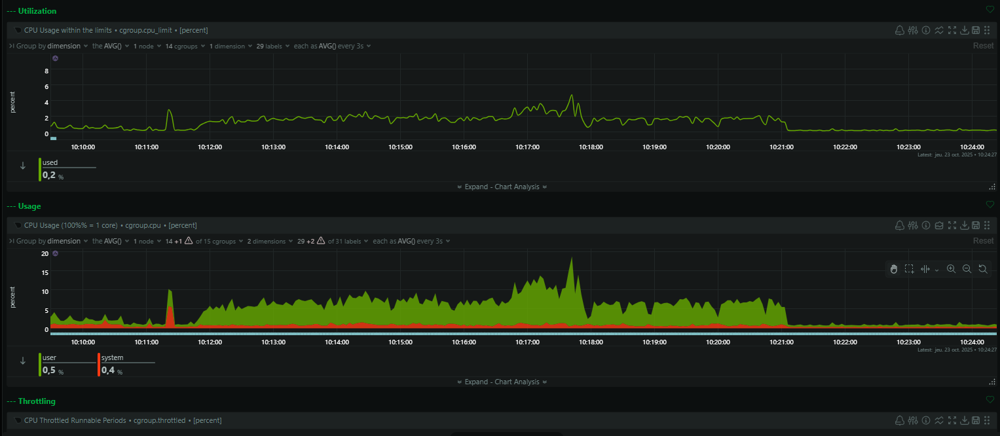

**| E5 - Metz - CACCIATORE Vincent |**  
***avec GRECO Clément***

*22 octobre 2025*

# XXX

## 📑 Table des matières
XXXX

---

> **But** : démontrer l’intérêt d’une stratégie d’**adversary emulation** en déployant un lab *all-in-one*, en lançant des attaques automatisées/contrôlées et en montrant les traces dans un SIEM/outil d’observabilité.  
> **Périmètre** : lab local (VM Ubuntu Server / Docker Compose). Pas d’expositions publiques.

---

## 1. Contexte & consignes (rappel)
- Déployer un lab “tout-en-un” prêt à l’emploi contenant au minimum :  
  - une instance Linux (cibles),  
  - un serveur de monitoring/observabilité,  
  - un serveur C2,  
  - un SIEM / visualisation des logs.  
- Pouvoir simuler des cyberattaques (automatiques si possible) et visualiser les traces remontées.  
- Produire un document décrivant la démarche, étapes, commandes et captures à fournir.

---

## 2. Architecture déployée (description de mon infra)

```bash
services:
  # ---------- WAZUH INDEXER ----------
  wazuh.indexer:
    image: wazuh/wazuh-indexer:4.13.1
    hostname: wazuh.indexer
    restart: always
    ports:
      - "9200:9200"
    environment:
      - OPENSEARCH_JAVA_OPTS=-Xms1g -Xmx1g
    ulimits:
      memlock: { soft: -1, hard: -1 }
      nofile:  { soft: 65536, hard: 65536 }
    volumes:
      - wazuh-indexer-data:/var/lib/wazuh-indexer
      - ./wazuh-docker/single-node/config/wazuh_indexer_ssl_certs/root-ca.pem:/usr/share/wazuh-indexer/certs/root-ca.pem:ro
      - ./wazuh-docker/single-node/config/wazuh_indexer_ssl_certs/wazuh.indexer-key.pem:/usr/share/wazuh-indexer/certs/wazuh.indexer.key:ro
      - ./wazuh-docker/single-node/config/wazuh_indexer_ssl_certs/wazuh.indexer.pem:/usr/share/wazuh-indexer/certs/wazuh.indexer.pem:ro
      - ./wazuh-docker/single-node/config/wazuh_indexer_ssl_certs/admin.pem:/usr/share/wazuh-indexer/certs/admin.pem:ro
      - ./wazuh-docker/single-node/config/wazuh_indexer_ssl_certs/admin-key.pem:/usr/share/wazuh-indexer/certs/admin-key.pem:ro
      - ./wazuh-docker/single-node/config/wazuh_indexer/wazuh.indexer.yml:/usr/share/wazuh-indexer/opensearch.yml:ro
      - ./wazuh-docker/single-node/config/wazuh_indexer/internal_users.yml:/usr/share/wazuh-indexer/opensearch-security/internal_users.yml:ro

  # ---------- WAZUH MANAGER ----------
  wazuh.manager:
    image: wazuh/wazuh-manager:4.13.1
    hostname: wazuh.manager
    restart: always
    ulimits:
      memlock: { soft: -1, hard: -1 }
      nofile:  { soft: 655360, hard: 655360 }
    ports:
      - "1514:1514"
      - "1515:1515"
      - "514:514/udp"
      - "55000:55000"
    environment:
      - INDEXER_URL=https://wazuh.indexer:9200
      - INDEXER_USERNAME=admin
      - INDEXER_PASSWORD=SecretPassword
      - FILEBEAT_SSL_VERIFICATION_MODE=full
      - SSL_CERTIFICATE_AUTHORITIES=/etc/ssl/root-ca.pem
      - SSL_CERTIFICATE=/etc/ssl/filebeat.pem
      - SSL_KEY=/etc/ssl/filebeat.key
      - API_USERNAME=wazuh-wui
      - API_PASSWORD=MyS3cr37P450r.*-
    volumes:
      - wazuh_api_configuration:/var/ossec/api/configuration
      - wazuh_etc:/var/ossec/etc
      - wazuh_logs:/var/ossec/logs
      - wazuh_queue:/var/ossec/queue
      - wazuh_var_multigroups:/var/ossec/var/multigroups
      - wazuh_integrations:/var/ossec/integrations
      - wazuh_active_response:/var/ossec/active-response/bin
      - wazuh_agentless:/var/ossec/agentless
      - wazuh_wodles:/var/ossec/wodles
      - filebeat_etc:/etc/filebeat
      - filebeat_var:/var/lib/filebeat
      - ./wazuh-docker/single-node/config/wazuh_indexer_ssl_certs/root-ca-manager.pem:/etc/ssl/root-ca.pem:ro
      - ./wazuh-docker/single-node/config/wazuh_indexer_ssl_certs/wazuh.manager.pem:/etc/ssl/filebeat.pem:ro
      - ./wazuh-docker/single-node/config/wazuh_indexer_ssl_certs/wazuh.manager-key.pem:/etc/ssl/filebeat.key:ro
      - ./wazuh-docker/single-node/config/wazuh_cluster/wazuh_manager.conf:/wazuh-config-mount/etc/ossec.conf:ro
    depends_on:
      - wazuh.indexer

  # ---------- WAZUH DASHBOARD ----------
  wazuh.dashboard:
    image: wazuh/wazuh-dashboard:4.13.1
    hostname: wazuh.dashboard
    restart: always
    ports:
      - "443:5601"
    environment:
      - INDEXER_USERNAME=admin
      - INDEXER_PASSWORD=SecretPassword
      - WAZUH_API_URL=https://wazuh.manager
      - DASHBOARD_USERNAME=kibanaserver
      - DASHBOARD_PASSWORD=kibanaserver
      - API_USERNAME=wazuh-wui
      - API_PASSWORD=MyS3cr37P450r.*-
    volumes:
      - ./wazuh-docker/single-node/config/wazuh_indexer_ssl_certs/wazuh.dashboard.pem:/usr/share/wazuh-dashboard/certs/wazuh-dashboard.pem:ro
      - ./wazuh-docker/single-node/config/wazuh_indexer_ssl_certs/wazuh.dashboard-key.pem:/usr/share/wazuh-dashboard/certs/wazuh-dashboard-key.pem:ro
      - ./wazuh-docker/single-node/config/wazuh_indexer_ssl_certs/root-ca.pem:/usr/share/wazuh-dashboard/certs/root-ca.pem:ro
      - ./wazuh-docker/single-node/config/wazuh_dashboard/opensearch_dashboards.yml:/usr/share/wazuh-dashboard/config/opensearch_dashboards.yml:ro
      - ./wazuh-docker/single-node/config/wazuh_dashboard/wazuh.yml:/usr/share/wazuh-dashboard/data/wazuh/config/wazuh.yml:ro
      - wazuh-dashboard-config:/usr/share/wazuh-dashboard/data/wazuh/config
      - wazuh-dashboard-custom:/usr/share/wazuh-dashboard/plugins/wazuh/public/assets/custom
    depends_on:
      - wazuh.indexer
      - wazuh.manager

  # Agent Wazuh pour la cible "hello"
  wazuh.agent-hello:
    image: wazuh/wazuh-agent:4.13.1
    hostname: hello-agent
    depends_on:
      - wazuh.manager
    environment:
      - WAZUH_MANAGER=wazuh.manager
      - WAZUH_AGENT_GROUP=linux
      - WAZUH_AGENT_NAME=hello-agent
    networks: [ default ]

  # Agent Wazuh pour la cible "juice-shop"
  wazuh.agent-juice:
    image: wazuh/wazuh-agent:4.13.1
    hostname: juice-agent
    depends_on:
      - wazuh.manager
    environment:
      - WAZUH_MANAGER=wazuh.manager
      - WAZUH_AGENT_GROUP=linux
      - WAZUH_AGENT_NAME=juice-agent
    networks: [ default ]


  # ---------- CALDERA ----------
  caldera:
    image: ghcr.io/mitre/caldera:latest
    container_name: caldera
    restart: unless-stopped
    ports:
      - "8888:8888"
    volumes:
      - caldera_data:/caldera/data
    environment:
      - CALDERA_INSECURE=true

  # ---------- MongoDB ----------
  mongo:
    image: mongo:4.4
    platform: linux/amd64
    container_name: mongo
    hostname: mongo
    restart: unless-stopped
    ports:
      - "27017:27017"
    volumes:
      - monkey-tutorial-db:/data/db
    healthcheck:
      test: ["CMD", "mongo", "--quiet", "--eval", "db.runCommand({ ping: 1 }).ok"]
      interval: 10s
      timeout: 5s
      retries: 12

  # ---------- Infection Monkey ----------
  monkey-island:
    image: infectionmonkey/monkey-island:e7c59c79d
    container_name: monkey-island
    hostname: monkey-island
    restart: unless-stopped
    ports:
      - "5000:5000"
    environment:
      - MONKEY_MONGO_URL=mongodb://mongo:27017/monkey_island_test
      - MONGO_URL=mongodb://mongo:27017/monkey_island_test
    depends_on:
      mongo:
        condition: service_healthy

  # ---------- Machine cible "hello" (SSH) ----------
  hello:
    image: infectionmonkey/ssh1
    container_name: hello
    hostname: hello
    command: '/usr/sbin/sshd -D && sh -c "trap : TERM INT; tail -f /dev/null & wait"'
    # Si tu veux exposer le SSH du conteneur :
    # ports:
    #   - "2222:22"

  # ---------- NETDATA ----------
  netdata:
    image: netdata/netdata:latest
    container_name: netdata
    hostname: netdata
    cap_add: ["SYS_PTRACE"]
    pid: "host"
    restart: unless-stopped
    ports:
      - "19999:19999"
    volumes:
      - netdata_lib:/var/lib/netdata
      - netdata_etc:/etc/netdata
      - /proc:/host/proc:ro
      - /sys:/host/sys:ro
      - /etc/passwd:/host/etc/passwd:ro
      - /var/run/docker.sock:/var/run/docker.sock:ro


  # ---------- Windows Server (dockurr/windows) ----------
  windows:
    image: dockurr/windows
    container_name: windows
    restart: unless-stopped
    environment:
      VERSION: "2019"
      RAM_SIZE: "6G"
      CPU_CORES: "2"
      # PASSWORD: "P@ssw0rd!"
    devices:
      - /dev/kvm
      - /dev/net/tun
    cap_add:
      - NET_ADMIN
    sysctls:
      - net.ipv4.ip_forward=1
    ports:
      - "8006:8006"      # console dockurr
      - "3389:3389/tcp"  # RDP
      - "3389:3389/udp"
    volumes:
      - ./windows:/storage

# ---------- VOLUMES ----------
volumes:
  # Wazuh
  wazuh_api_configuration:
  wazuh_etc:
  wazuh_logs:
  wazuh_queue:
  wazuh_var_multigroups:
  wazuh_integrations:
  wazuh_active_response:
  wazuh_agentless:
  wazuh_wodles:
  filebeat_etc:
  filebeat_var:
  wazuh-indexer-data:
  wazuh-dashboard-config:
  wazuh-dashboard-custom:

  # Ajouts
  caldera_data:
  monkey-tutorial-db:
  netdata_lib:
  netdata_etc:
```

Stack lancée depuis `~/Final` via `docker compose up -d` :

- **Wazuh Indexer** (`wazuh.indexer:4.13.1`) — indexation / moteur (port `9200`)  
- **Wazuh Manager** (`wazuh.manager:4.13.1`) — collecte / rules / API (ports `1514`, `1515`, `514/udp`, `55000`)  
- **Wazuh Dashboard** (`wazuh.dashboard:4.13.1`) — UI/Kibana (port `443` exposé)  
- **Caldera** (`caldera`) — C2 pour émulation d’adversaire (port `8888`)  
- **MongoDB** + **Infection Monkey (monkey-island)** — outil d’attaque automatique (port `5000`)  
- **Cibles** : `hello` (SSH vuln container), (optionnel) `juice-shop` si présent  
- **Agents Wazuh** : `wazuh.agent-hello`, `wazuh.agent-juice` — pour remonter télémétrie depuis les cibles  
- **Netdata** (`netdata`) — observabilité temps réel (port `19999`)  
- **Windows (dockurr/windows)** — optionnel (profil bonus), fonctionne si `/dev/kvm` dispo

Tous les services sont sur le même réseau Docker (réseau `default` ou `labnet` selon compose).

---

### A. **Stress test** - Visualisation Netdata

#### Objectif
Générer une charge HTTP élevée sur plusieurs conteneurs web pour :
- observer l’impact CPU/Mémoire/Réseau/Disk dans **Netdata**,
- valider que Netdata identifie les conteneurs par nom (ou activer liaison `docker.sock`),
- produire captures & métriques pour le rapport.

> **ATTENTION** : tests agressifs peuvent saturer la VM / faire swapper / rendre la VM inutilisable.

---

#### 1 — Déployer trois conteneurs web (commandes)
Copier/coller sur la VM hôte (ou exécuter localement si Docker installé) :

```bash
# Caddy (port 80)
docker run -d -p 80:80 --name mycaddy caddy

# Nginx (alpine-slim) → port 8080 sur l'hôte
docker run -d --name myalpineslimginx -p 8080:80 nginx:alpine-slim

# httpd (apache alpine) → port 9090 sur l'hôte
docker run -d --name myhttpd -p 9090:80 httpd:alpine
```

Vérifier :
```bash
docker ps --format "table {{.Names}}	{{.Image}}	{{.Ports}}"
```

---

#### 2 — Installer l’outil de bench (`ab`)
Sur l’Ubuntu (où tu lances les tests) :
```bash
sudo apt update
sudo apt install -y apache2-utils
```

---

#### 3 — Tests de charge (progressifs)

##### 1) Test de fumée (safe)
```bash
ab -n 1000 -c 10 http://127.0.0.1:8080/
ab -n 1000 -c 10 http://127.0.0.1:9090/
ab -n 1000 -c 10 http://127.0.0.1/
```

##### 2) Test intermédiaire (montée en charge)
```bash
ab -n 10000 -c 100 http://127.0.0.1:8080/ &
ab -n 10000 -c 100 http://127.0.0.1:9090/ &
ab -n 10000 -c 100 http://127.0.0.1/ &
```
(le `&` lance en arrière-plan — surveille `top`/`htop`)

##### 3) Test agressif (⚠️ très lourd — n’utiliser que si tu as suffisamment de ressources)
Remplace `10.153.226.8` par l’IP de ta VM si `ab` est lancé depuis une autre machine.  
```bash
ab -n 10000000 -c 1000 http://127.0.0.1:8080/ &
ab -n 10000000 -c 1000 http://127.0.0.1:9090/ &
ab -n 10000000 -c 1000 http://127.0.0.1/ &
```

##### 4) Lancer proprement en arrière-plan (recommandé si session SSH)
```bash
nohup ab -n 10000000 -c 1000 http://127.0.0.1:8080/ > nginx_ab_8080.log 2>&1 &
nohup ab -n 10000000 -c 1000 http://127.0.0.1:9090/ > httpd_ab_9090.log 2>&1 &
nohup ab -n 10000000 -c 1000 http://127.0.0.1/    > caddy_ab_80.log 2>&1 &
```

Pour arrêter tous les `ab` :
```bash
pkill ab
```

---

#### 4 — Surveillance & vérifications pendant le test

Dans **Netdata** (`http://localhost:19999`) :  
- **Containers & VMs → Cgroups** : CPU / Memory / Disk I/O par conteneur  
- **Docker Engine** (si activé) : connectivité & réseau par container  
- **System Overview** : load average, CPU % global, swap, disk I/O

**Avant le stress test** :



**Pendant le stress test** :


---

#### 5 — Interprétation
- **Conteneurs qui consomment le plus CPU** → corrélation avec `ab` ciblant le port (nginx/httpd/caddy).  
- **Saturation CPU → montée du load average** → risque d’échec de réponses, augmentation latence, erreurs 5xx.  
- **Swap utilisé** → VM insuffisante => réduire charge ou augmenter RAM.  
- **Disk I/O élevé** → logs/Indexing qui sature le disque (Wazuh Indexer peut générer I/O).  
- **Network I/O** → pics pendant benchs (exfil possible si simulateur d’exfil).  
- **Erreurs HTTP (5xx)** dans les logs applicatifs (si juice-shop/nginx/httpd retournent des erreurs).

Ce premier stress test valide la visibilité de l’infrastructure via Netdata et montre la montée en charge maîtrisée des conteneurs. Il sert de point de référence pour mesurer l’impact des futures opérations offensives